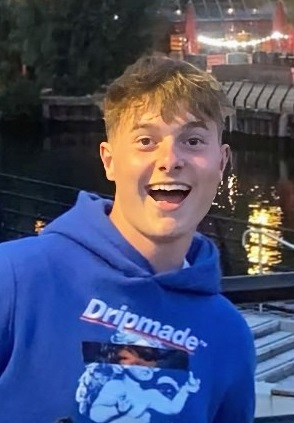

---

# Home

## Welcome to the 2025 Hack-A-Bot competition!

Welcome to Hack-A-Bot 2025! This site is your go-to hub for everything happening during the hackathon. Here you’ll find details on each challenge task (which you should have already selected), as well as links to example code, tutorials, and other resources to get you up and running. Whether you’re stuck, curious, or just exploring, you’ll find what you need right here.

---

## Table of Contents

- [Introduction](#introduction)
- [Announcements](#announcements)
- [Technical Info](#technical-info)
- [Supervisor Support](#supervisor-support)
- [Safety Guidelines](#safety-guidelines)
- [Merch](#merch)

---

## Introduction

Hack-A-Bot is run by students, for students — with help from a lot of robots, arduinos and Raspberry Pis.

The event is organised by the UoM Robotics Society Events Team, with key leads being:

  <figure style="text-align: center;">
    
    <figcaption>Archie</figcaption>
  </figure>
  <figure style="text-align: center;">
    
    <figcaption>Ted</figcaption>
  </figure>
  <figure style="text-align: center;">
    
    <figcaption>Izzy</figcaption>
  </figure>
  <figure style="text-align: center;">
    
    <figcaption>Thierry</figcaption>
  </figure>

If you need any help during the event, speak to **anyone wearing a green supervisor t-shirt**.

Need info on your chosen task? Just check the sidebar to the right — every task has its own page.  
Want to know when things are happening? Head to the **Schedule** tab.

---

## Announcements

We’ll post important technical announcements in the **Announcements** section of the sidebar — this includes last-minute updates, website changes, and more.

For everything else — including cool stuff like live mini-event notifications — check our ongoing Instagram story:  
📱 [@uom_robosoc](https://instagram.com/uom_robosoc)

---

## Technical Info

We’re based in the **Nancy Rothwell Building** (previously known as the Engineering Building or MECD) — please stick to the designated floors during the hackathon.

- **Makerspace** (Ground Floor): For collecting components and materials.  
  {: .warning }
 > Check the inventory list before asking technicians for help.
- Power outlets and workspaces are located on the 1st and 2nd floors.
- Refreshments and chill-out zones are available in the **Meet and Greet Space on the Ground Floor** next to the vending machines.

There’ll be mini-events like the **Robot Fighting League** throughout the weekend — keep an eye on the Announcements tab and our Instagram for when they pop up!

---

## Supervisor Support

Throughout the event, supervisors will be around to help out and keep things running smoothly. Here's how they can support you and what you should know:

#### Who Are They?

Supervisors will be clearly identifiable by their green shirts and are here to help! If you’re unsure about anything, feel free to ask them.

If something more serious comes up, speak to **Izzy, Thierry, Ted, or Archie** — they'll be around throughout the event.

#### Where You’ll See Supervisors

- **Roaming Supervisors** (Ground, First & Second Floors)  
  - Available to answer questions and provide directions.
  - Will redirect anyone sleeping to the rest area near **Makerspace and the Spanish Steps**.

- **Makerspace Supervisors**  
  - **Inventory Desk:** They’ll manage distribution of parts and components. Be ready to explain your project before collecting materials.  
  - **Roaming Support:** Enforcing safety rules, offering assistance, and keeping the space safe and calm.  
  - **3D Printing:** Helping you set up and run 3D prints safely and effectively.

#### Quick Reminders

- **Be respectful and patient** with supervisors — they’re students just like you, giving up their weekend to make this event possible.
- **Follow instructions** in the Makerspace and respect decisions around safety and equipment use.
- If you’re asked to take a break or move due to safety or capacity reasons, please cooperate.

If in doubt, **just ask** — we're here to help.

---

## Safety Guidelines

All participants must have completed the Makerspace safety induction to use the makerspace. 

[Makerspace Induction](https://online.manchester.ac.uk/webapps/blackboard/content/listContentEditable.jsp?content_id=_14584806_1&course_id=_75608_1&mode=reset)

Follow the link, login to your manchester account and click on *Makerspace Local Induction*
You have to complete the induction course first then achieve 100% on the quiz.

---

## Merch

You should’ve received your official Hack-A-Bot merch at registration.  
Didn’t get any? Want more? Speak to a supervisor and we’ll sort you out.

---

## Our Sponsors

  
  
  
  
  
  

